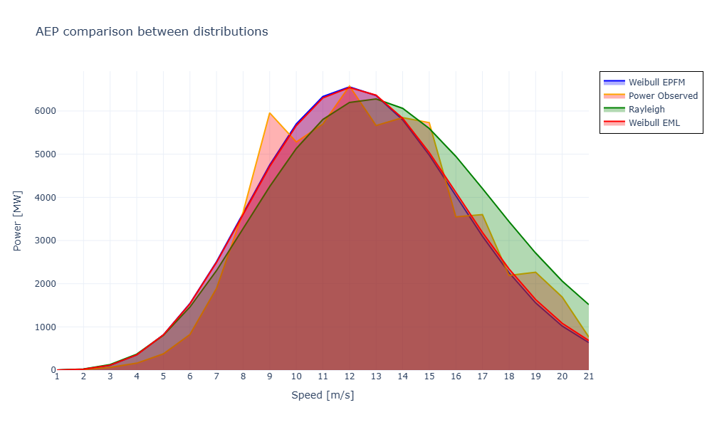
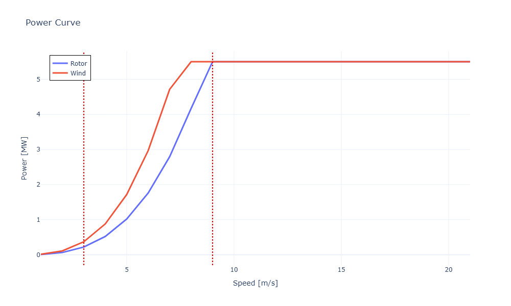

# Annual-Energy-Production-Estimation-using-Weibull-and-Rayleigh-Distributions
Specialized AEP based on the input coordinates and turbine parameters using statistical distributions.

  

In this work, an open-source tool for wind energy project sizing is presented to support renewable energy implementation. Wind energy is a clean, renewable, and cost-effective energy source that reduces greenhouse gas emissions, it requires accurate resource assessment tools for its planning and implementation. The developed application implements the Energy Pattern Factor Method (EPFM), Empirical Maximum Likelihood (EML), and Rayleigh distribution to estimate wind resource characteristics and calculate key technical and economic indicators, including the Annual Energy Production (AEP), Capacity Factor (CF), and Levelized Cost of Energy (LCOE). The tool was applied to compare three locations through an interactive graphical interface. Among the evaluated sites, Juchitán de Zaragoza, Oaxaca, Mexico, exhibited the highest wind energy potential, with an estimated AEP of 28.9 GWh/year and an LCOE of 25.8 [\$/MWh], assuming a 25 year project lifetime and a 5.5 MW Nordex N169/5.X wind turbine using manufacturer specifications. The proposed tool provides an accessible framework for preliminary wind energy project assessment and supports informed decision-making for renewable energy deployment

  

The output consists of the AEP and Capacity Factor for one turbine in the desired location using EPFM and EML Weibull distribution methods and Rayleigh distribution method. It allows the user to download the data collected from the NASA POWER DAV at the desired location as well as the frequency, probabilities ans power generated in each speed interval. The user can analyze each distribution method through graphs, the power curve of the wind power and rotor power is also visible with the cut-in and cut-out lines. Finally, the speed at different heights and the wind rose are available for more analysis. In order to compare different locations, a tab for 3 location comparison was added so the user can type the 3 coordinates and the 3 specifications for the turbines in each location and the system outputs the best location (lowest LCOE) and it also displays a table comparing each location.

  
  
